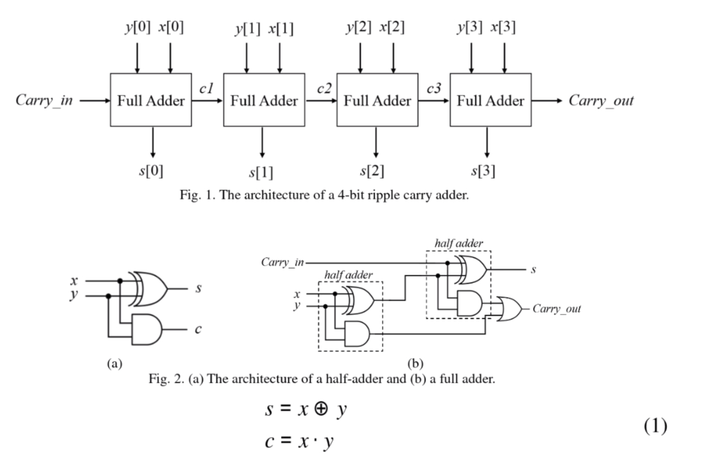

# Digital IC Design Homework

## DIC HW1-RippleCarryAdder

### Introduction
- The ripple carry adder (RCA) circuit can be built using a cascade architecture of 1-bit full-adders. As a result, a 4-bit RCA comprises four 1-bit full-adders, which is shown in Fig. 1. In addition, a full-adder can also be constructed by two half-adders and one OR gate. Assume that x and y are 1-bit input signals and s and c are outputs standing for sum and carry. The computation of the half adder can be represented as (1). Fig. 2 illustrates the architecture of a half adder and a full adder. In this homework, please design a 4-bit ripple carry adder according to Fig. 1 in Gate Level. You are suggested to design the circuit using hierarchy modules including series of half adders and full adders. The values are considered as unsigned integers.

## AUTHORS
[Yu-Tong Shen](https://github.com/yutongshen/)
